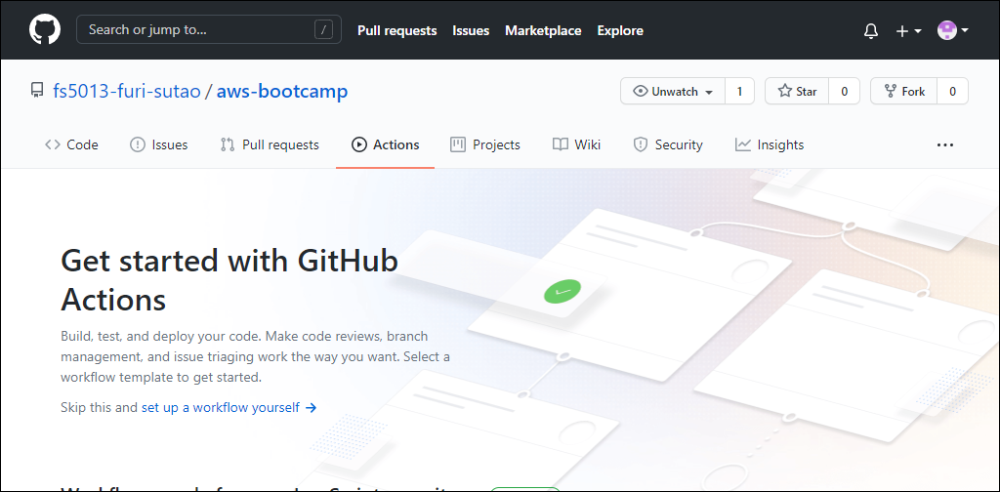
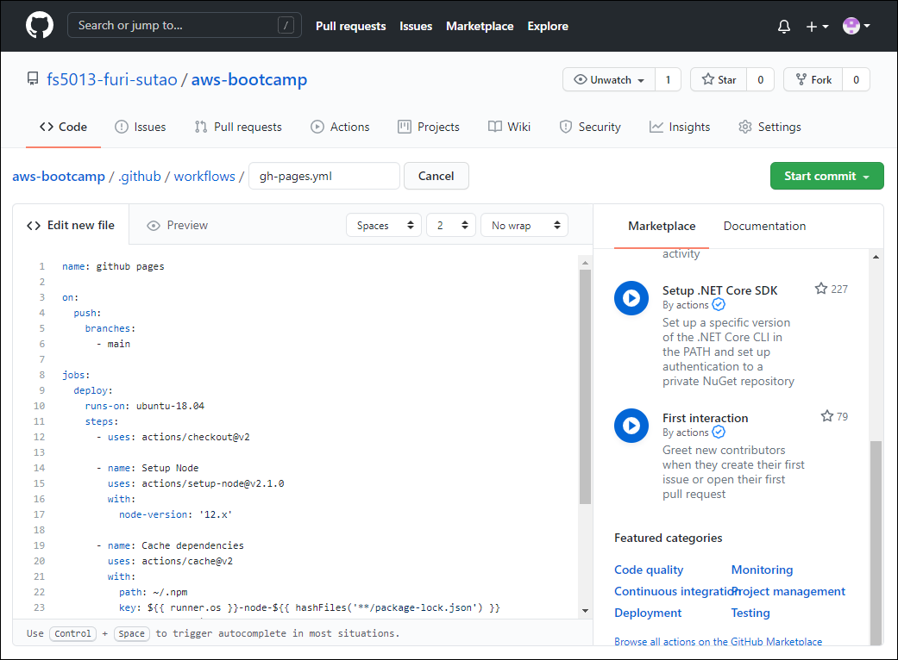
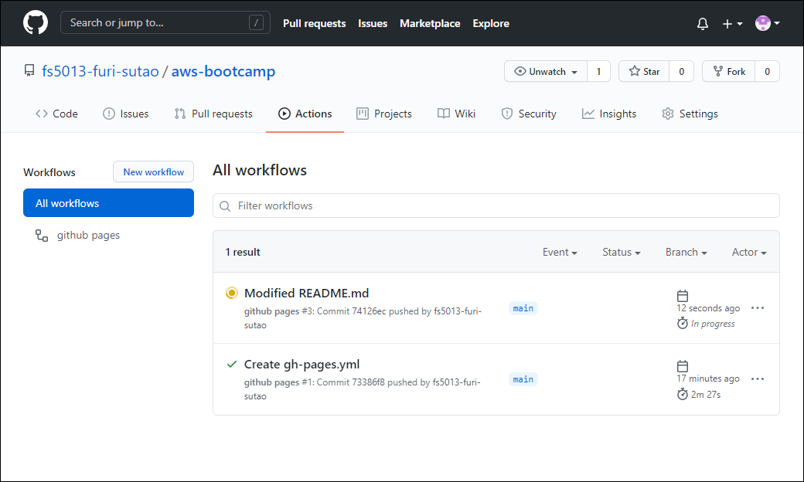
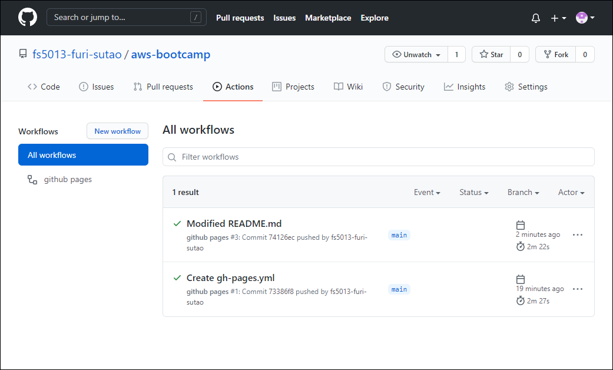

# GitHub Actions で GitHub Pages へのデプロイを自動化する方法

リポジトリの Actions タブを押し、「set up workflow yourself」リンクをクリックする。



workflow ファイルを以下の内容で、「gh-pages.yml」として「Start commit」ボタンをクリックする。



```yaml
name: github pages

on:
  push:
    branches:
      - main

jobs:
  deploy:
    runs-on: ubuntu-18.04
    steps:
      - uses: actions/checkout@v2

      - name: Setup Node
        uses: actions/setup-node@v1
        with:
          node-version: '12.x'

      - name: Cache dependencies
        uses: actions/cache@v2
        with:
          path: ~/.npm
          key: ${{ runner.os }}-node-${{ hashFiles('**/package-lock.json') }}
          restore-keys: |
            ${{ runner.os }}-node-
      - run: yarn
      - run: yarn build

      - name: Deploy
        uses: peaceiris/actions-gh-pages@v3
        with:
          github_token: ${{ secrets.GITHUB_TOKEN }}
          publish_dir: ./public
```

これで、`./.github/workflow/` ディレクトリに yml ファイルがコミットされる。

コミットが確認出来たら、`git pull` で workflow ファイルをプルする。

この状態になれば、自動デプロイ環境は整っている。

試しに、ローカルを変更し、コミット、プッシュを行う。main ブランチへのプッシュをトリガに GitHub Actions が起動する。



大きなプロジェクトでなければ、20 ～ 30 秒ほどでデプロイが完了する。


